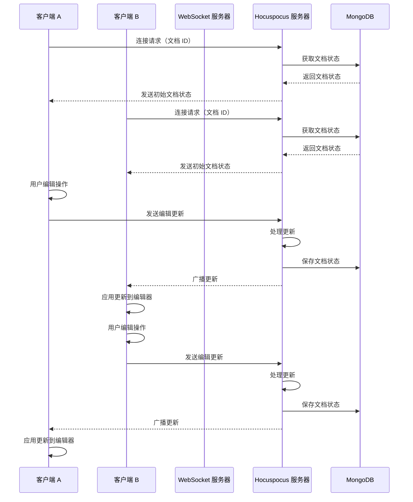

# 实时协作移植

## 1. 实时协作功能概述

### 1.1 功能介绍

**实时协作编辑**是 DocFlow 的核心功能之一，允许多个用户同时编辑同一文档，实时同步编辑内容，提高团队协作效率。主要特点包括：

- **实时同步**：用户的编辑操作实时同步到其他用户的编辑器
- **冲突解决**：自动处理编辑冲突，确保数据一致性
- **用户状态**：显示在线用户列表和编辑状态
- **操作轨迹**：记录用户的编辑操作，支持撤销/重做
- **离线编辑**：支持离线编辑，重新连接后自动同步

### 1.2 技术原理

**核心技术**：

| 技术 | 描述 | 用途 |
|------|------|------|
| Yjs | CRDT（冲突检测与解决）算法库 | 处理并发编辑冲突 |
| WebSocket | 双向实时通信协议 | 实现客户端与服务器的实时通信 |
| Hocuspocus | Yjs 协作服务器 | 管理文档状态和客户端连接 |
| ProseMirror | 富文本编辑器框架 | 提供编辑器核心功能 |
| Tiptap | ProseMirror 封装库 | 简化编辑器使用 |

**工作流程**：

1. **客户端初始化**：创建 Yjs 文档，连接到协作服务器
2. **文档同步**：从服务器获取最新文档状态
3. **实时编辑**：用户编辑时，Yjs 生成更新并发送到服务器
4. **服务器广播**：服务器接收更新并广播给其他客户端
5. **客户端应用**：其他客户端接收更新并应用到本地编辑器
6. **冲突解决**：Yjs 自动处理冲突，确保数据一致性

## 2. 技术栈选择

### 2.1 前端技术

| 技术 | 版本 | 用途 | 来源 |
|------|------|------|------|
| Yjs | 13.6.16 | CRDT 算法实现 | https://unpkg.com/yjs@13.6.16/dist/y.js |
| y-websocket | 1.5.4 | WebSocket 连接管理 | https://unpkg.com/y-websocket@1.5.4/dist/y-websocket.js |
| Tiptap | 2.5.8 | 编辑器框架 | https://unpkg.com/@tiptap/core@2.5.8/dist/tiptap-core.js |
| ProseMirror | 1.32.12 | 编辑器核心 | https://unpkg.com/prosemirror-view@1.32.12/dist/prosemirror-view.js |
| Vue | 2.x | 前端框架 | 项目现有 |

### 2.2 后端技术

| 技术 | 版本 | 用途 | 来源 |
|------|------|------|------|
| Node.js | 14+ | 运行环境 | 服务器现有 |
| Hocuspocus | 2.13.2 | Yjs 协作服务器 | https://www.npmjs.com/package/@hocuspocus/server |
| WebSocket | - | 实时通信 | Node.js 内置 |
| MongoDB | 4.0+ | 数据存储 | 项目现有 |

## 3. 架构设计

### 3.1 系统架构



### 3.2 模块划分

**前端模块**：

| 模块 | 职责 | 文件位置 |
|------|------|----------|
| 协作编辑器 | 集成 Tiptap 和 Yjs | `components/DocFlow/Collaboration.vue` |
| Yjs 客户端 | 管理 Yjs 文档和连接 | `utils/docflow/yjs-client.js` |
| 用户状态 | 显示在线用户和状态 | `components/DocFlow/UserList.vue` |
| 连接管理 | 处理连接状态和错误 | `utils/docflow/connection.js` |

**后端模块**：

| 模块 | 职责 | 文件位置 |
|------|------|----------|
| 协作服务器 | 管理文档状态和连接 | `server/plugins/hocuspocus.js` |
| WebSocket 服务 | 处理 WebSocket 连接 | `server/plugins/websocket.js` |
| 文档存储 | 保存文档状态到数据库 | `server/models/DocFlowDocument.js` |
| 认证授权 | 验证用户身份和权限 | `server/middleware/auth.js` |

### 3.3 数据流设计

**数据结构**：

1. **文档状态**
   ```javascript
   {
     id: "doc_123",
     title: "协作文档",
     content: "<p>文档内容</p>",
     yjsState: "[Yjs 编码状态]",
     createdAt: "2024-01-01T00:00:00Z",
     updatedAt: "2024-01-01T00:00:00Z",
     users: ["user_1", "user_2"]
   }
   ```

2. **用户状态**
   ```javascript
   {
     id: "user_1",
     name: "用户1",
     avatar: "avatar_url",
     status: "editing", // online, editing, idle
     lastActive: "2024-01-01T00:00:00Z"
   }
   ```

3. **编辑更新**
   ```javascript
   {
     documentId: "doc_123",
     userId: "user_1",
     updates: "[Yjs 更新数据]",
     timestamp: "2024-01-01T00:00:00Z"
   }
   ```

**数据流**：

1. **客户端到服务器**：编辑操作 → Yjs 更新 → WebSocket → 服务器
2. **服务器内部**：接收更新 → 处理冲突 → 保存状态 → 广播更新
3. **服务器到客户端**：广播更新 → WebSocket → 客户端 → 应用更新

## 3. 核心模块实现

### 3.1 前端实现

#### 3.1.1 Yjs 客户端

**文件：`utils/docflow/yjs-client.js`**

```javascript
// Yjs 客户端管理
class YjsClient {
  constructor() {
    this.ydoc = null;
    this.provider = null;
    this.editor = null;
    this.callbacks = {
      onUpdate: [],
      onConnect: [],
      onDisconnect: [],
      onError: []
    };
  }

  // 初始化
  init(options = {}) {
    const {
      documentId,
      editor,
      url = 'ws://localhost:1234'
    } = options;

    this.editor = editor;

    // 创建 Yjs 文档
    this.ydoc = new window.Y.Doc();

    // 创建 WebSocket 提供者
    this.provider = new window.Y.WebSocketProvider(
      url,
      documentId,
      this.ydoc
    );

    // 设置事件监听
    this.setupEventListeners();

    return this;
  }

  // 设置事件监听
  setupEventListeners() {
    // 连接状态变化
    this.provider.on('status', (event) => {
      if (event.status === 'connected') {
        this.triggerCallbacks('onConnect');
      } else if (event.status === 'disconnected') {
        this.triggerCallbacks('onDisconnect');
      }
    });

    // 连接错误
    this.provider.on('connection-error', (event) => {
      this.triggerCallbacks('onError', event.error);
    });
  }

  // 获取文档
  getDocument() {
    return this.ydoc;
  }

  // 获取连接状态
  getConnectionStatus() {
    return this.provider?.status || 'disconnected';
  }

  // 断开连接
  disconnect() {
    if (this.provider) {
      this.provider.disconnect();
      this.provider = null;
    }
    if (this.ydoc) {
      this.ydoc.destroy();
      this.ydoc = null;
    }
  }

  // 注册回调
  on(event, callback) {
    if (this.callbacks[event]) {
      this.callbacks[event].push(callback);
    }
  }

  // 触发回调
  triggerCallbacks(event, data) {
    if (this.callbacks[event]) {
      this.callbacks[event].forEach(callback => callback(data));
    }
  }
}

// 导出单例
export default new YjsClient();
```

#### 3.1.2 协作编辑器组件

**文件：`components/DocFlow/Collaboration.vue`**

```vue
<template>
  <div class="docflow-collaboration">
    <div class="collaboration-header">
      <h3>实时协作</h3>
      <div class="collaboration-status">
        <span :class="{ active: isConnected }">
          {{ isConnected ? '已连接' : '未连接' }}
        </span>
      </div>
    </div>

    <div class="collaboration-users">
      <h4>在线用户</h4>
      <div class="user-list">
        <div 
          v-for="user in onlineUsers" 
          :key="user.id"
          class="user-item"
        >
          <div class="user-avatar">{{ user.name.charAt(0) }}</div>
          <span class="user-name">{{ user.name }}</span>
          <span class="user-status">{{ user.status }}</span>
        </div>
      </div>
    </div>

    <div class="collaboration-editor">
      <div ref="editorContainer"></div>
    </div>
  </div>
</template>

<script lang="ts">
export default async function ({ PRIVATE_GLOBAL }) {
  // 动态加载依赖
  await _.$importVue([
    '/common/tiptap/tiptap-core.js',
    '/common/tiptap/tiptap-starter-kit.js',
    '/common/yjs/y.js',
    '/common/yjs/y-websocket.js',
    '@/utils/docflow/yjs-client.js'
  ]);

  return {
    props: {
      documentId: {
        type: String,
        default: ''
      },
      initialContent: {
        type: String,
        default: '<p>开始协作编辑...</p>'
      }
    },
    data() {
      return {
        isConnected: false,
        onlineUsers: [],
        editor: null,
        yjsClient: null
      };
    },
    mounted() {
      this.initCollaboration();
    },
    beforeUnmount() {
      this.destroyCollaboration();
    },
    methods: {
      // 初始化协作
      async initCollaboration() {
        try {
          // 初始化 Yjs 客户端
          this.yjsClient = new window.YjsClient();
          
          // 初始化编辑器
          await this.initEditor();

          // 连接到协作服务器
          this.yjsClient.init({
            documentId: this.documentId || 'default',
            editor: this.editor,
            url: 'ws://localhost:1234'
          });

          // 设置事件监听
          this.setupEventListeners();
        } catch (error) {
          console.error('初始化协作失败:', error);
        }
      },

      // 初始化编辑器
      async initEditor() {
        const { Editor } = window.TiptapCore;
        const { StarterKit } = window.TiptapStarterKit;

        this.editor = new Editor({
          element: this.$refs.editorContainer,
          extensions: [
            StarterKit
          ],
          content: this.initialContent,
          onUpdate: ({ editor }) => {
            // 编辑器更新时的处理
          }
        });
      },

      // 设置事件监听
      setupEventListeners() {
        // 连接状态
        this.yjsClient.on('onConnect', () => {
          this.isConnected = true;
          this.$emit('connect');
        });

        this.yjsClient.on('onDisconnect', () => {
          this.isConnected = false;
          this.$emit('disconnect');
        });

        this.yjsClient.on('onError', (error) => {
          console.error('协作错误:', error);
          this.$emit('error', error);
        });

        // 模拟在线用户
        setTimeout(() => {
          this.onlineUsers = [
            { id: '1', name: '用户1', status: '编辑中' },
            { id: '2', name: '用户2', status: '查看中' }
          ];
        }, 1000);
      },

      // 销毁协作
      destroyCollaboration() {
        if (this.yjsClient) {
          this.yjsClient.disconnect();
          this.yjsClient = null;
        }

        if (this.editor) {
          this.editor.destroy();
          this.editor = null;
        }
      },

      // 邀请用户
      inviteUser() {
        // 邀请用户逻辑
        this.$emit('invite');
      },

      // 离开协作
      leaveCollaboration() {
        this.destroyCollaboration();
        this.$emit('leave');
      }
    }
  };
}
</script>

<style scoped>
.docflow-collaboration {
  border: 1px solid #ddd;
  border-radius: 4px;
  overflow: hidden;
}

.collaboration-header {
  background: #f8f9fa;
  border-bottom: 1px solid #ddd;
  padding: 12px 16px;
  display: flex;
  justify-content: space-between;
  align-items: center;
}

.collaboration-header h3 {
  margin: 0;
  font-size: 16px;
  color: #333;
}

.collaboration-status {
  font-size: 14px;
}

.collaboration-status span {
  padding: 4px 8px;
  border-radius: 12px;
  background: #e9ecef;
  color: #6c757d;
}

.collaboration-status span.active {
  background: #d4edda;
  color: #155724;
}

.collaboration-users {
  padding: 16px;
  border-bottom: 1px solid #ddd;
}

.collaboration-users h4 {
  margin: 0 0 12px 0;
  font-size: 14px;
  color: #333;
}

.user-list {
  display: flex;
  flex-wrap: wrap;
  gap: 12px;
}

.user-item {
  display: flex;
  align-items: center;
  gap: 8px;
  padding: 8px 12px;
  background: #f8f9fa;
  border-radius: 16px;
  font-size: 14px;
}

.user-avatar {
  width: 24px;
  height: 24px;
  border-radius: 50%;
  background: #007bff;
  color: white;
  display: flex;
  align-items: center;
  justify-content: center;
  font-size: 12px;
  font-weight: bold;
}

.user-name {
  font-weight: 500;
  color: #333;
}

.user-status {
  font-size: 12px;
  color: #6c757d;
}

.collaboration-editor {
  padding: 16px;
}

.collaboration-editor :deep(.ProseMirror) {
  min-height: 400px;
  padding: 16px;
  border: 1px solid #ddd;
  border-radius: 4px;
  font-size: 16px;
  line-height: 1.6;
}
</style>
```

#### 3.1.2 用户状态组件

**文件：`components/DocFlow/UserList.vue`**

```vue
<template>
  <div class="user-list-container">
    <h4>在线用户 ({{ users.length }})</h4>
    <div class="user-list">
      <div 
        v-for="user in users" 
        :key="user.id"
        class="user-item"
        :class="{ active: user.id === currentUserId }"
      >
        <div class="user-avatar" :style="{ backgroundColor: user.color }">
          {{ user.name.charAt(0) }}
        </div>
        <div class="user-info">
          <div class="user-name">{{ user.name }}</div>
          <div class="user-status">{{ user.status }}</div>
        </div>
        <div class="user-indicator" :class="user.status"></div>
      </div>
    </div>
  </div>
</template>

<script lang="ts">
export default {
  props: {
    users: {
      type: Array,
      default: () => []
    },
    currentUserId: {
      type: String,
      default: ''
    }
  },
  data() {
    return {
      // 本地状态
    };
  },
  computed: {
    // 计算属性
  },
  methods: {
    // 方法
  }
};
</script>

<style scoped>
.user-list-container {
  padding: 16px;
  background: #f8f9fa;
  border-radius: 4px;
}

.user-list-container h4 {
  margin: 0 0 16px 0;
  font-size: 14px;
  color: #333;
}

.user-list {
  display: flex;
  flex-direction: column;
  gap: 12px;
}

.user-item {
  display: flex;
  align-items: center;
  gap: 12px;
  padding: 12px;
  background: white;
  border-radius: 8px;
  box-shadow: 0 1px 3px rgba(0, 0, 0, 0.1);
  transition: all 0.2s ease;
}

.user-item:hover {
  box-shadow: 0 2px 6px rgba(0, 0, 0, 0.15);
}

.user-item.active {
  border: 2px solid #007bff;
}

.user-avatar {
  width: 36px;
  height: 36px;
  border-radius: 50%;
  color: white;
  display: flex;
  align-items: center;
  justify-content: center;
  font-size: 14px;
  font-weight: bold;
  flex-shrink: 0;
}

.user-info {
  flex: 1;
  min-width: 0;
}

.user-name {
  font-size: 14px;
  font-weight: 500;
  color: #333;
  margin-bottom: 2px;
}

.user-status {
  font-size: 12px;
  color: #666;
}

.user-indicator {
  width: 8px;
  height: 8px;
  border-radius: 50%;
  flex-shrink: 0;
}

.user-indicator.online {
  background: #28a745;
}

.user-indicator.editing {
  background: #007bff;
  animation: pulse 2s infinite;
}

.user-indicator.idle {
  background: #ffc107;
}

@keyframes pulse {
  0% {
    transform: scale(1);
    opacity: 1;
  }
  50% {
    transform: scale(1.2);
    opacity: 0.7;
  }
  100% {
    transform: scale(1);
    opacity: 1;
  }
}
</style>
```

### 3.2 后端实现

#### 3.2.1 Hocuspocus 服务器

**文件：`server/plugins/hocuspocus.js`**

```javascript
// Hocuspocus 协作服务器
const { Server } = require('@hocuspocus/server');
const { MongoDB } = require('@hocuspocus/extension-mongodb');
const mongoose = require('mongoose');

// 文档模型
const DocFlowDocument = mongoose.model('DocFlowDocument', {
  _id: String,
  title: String,
  content: String,
  yjsState: Buffer,
  createdAt: Date,
  updatedAt: Date,
  users: [String]
});

// 创建服务器
const server = Server.configure({
  port: 1234,
  hostname: '0.0.0.0',
  extensions: [
    new MongoDB({
      url: 'mongodb://localhost:27017/yapi',
      collection: 'docflow_documents',
    }),
  ],
  onConnect(data) {
    console.log('客户端连接:', data.connectionId);
  },
  onDisconnect(data) {
    console.log('客户端断开连接:', data.connectionId);
  },
  onAuthenticate(data) {
    // 认证逻辑
    return {
      user: {
        id: data.token,
        name: 'User',
      },
    };
  },
  onChange(data) {
    // 文档变化时的处理
    console.log('文档变化:', data.documentName);
  },
});

// 启动服务器
server.listen();
console.log('Hocuspocus 服务器已启动，端口: 1234');

module.exports = server;
```

#### 3.2.2 WebSocket 服务

**文件：`server/plugins/websocket.js`**

```javascript
// WebSocket 服务
const WebSocket = require('ws');

class WebSocketServer {
  constructor(server) {
    this.wss = new WebSocket.Server({ server });
    this.clients = new Map();
    this.setupEventListeners();
  }

  setupEventListeners() {
    this.wss.on('connection', (ws, req) => {
      const clientId = this.generateClientId();
      this.clients.set(clientId, ws);

      console.log('WebSocket 客户端连接:', clientId);

      // 发送欢迎消息
      ws.send(JSON.stringify({
        type: 'welcome',
        clientId
      }));

      // 接收消息
      ws.on('message', (message) => {
        this.handleMessage(clientId, message);
      });

      // 连接关闭
      ws.on('close', () => {
        this.clients.delete(clientId);
        console.log('WebSocket 客户端断开连接:', clientId);
      });

      // 连接错误
      ws.on('error', (error) => {
        console.error('WebSocket 错误:', error);
      });
    });
  }

  // 生成客户端 ID
  generateClientId() {
    return 'client_' + Math.random().toString(36).substr(2, 9);
  }

  // 处理消息
  handleMessage(clientId, message) {
    try {
      const data = JSON.parse(message);
      console.log('收到消息:', data);

      // 根据消息类型处理
      switch (data.type) {
        case 'ping':
          this.send(clientId, { type: 'pong' });
          break;
        case 'broadcast':
          this.broadcast(data.payload);
          break;
        default:
          console.log('未知消息类型:', data.type);
      }
    } catch (error) {
      console.error('处理消息错误:', error);
    }
  }

  // 发送消息
  send(clientId, message) {
    const client = this.clients.get(clientId);
    if (client && client.readyState === WebSocket.OPEN) {
      client.send(JSON.stringify(message));
    }
  }

  // 广播消息
  broadcast(message) {
    const data = JSON.stringify(message);
    this.clients.forEach((client) => {
      if (client.readyState === WebSocket.OPEN) {
        client.send(data);
      }
    });
  }

  // 获取客户端数量
  getClientCount() {
    return this.clients.size;
  }
}

module.exports = WebSocketServer;
```

#### 3.2.3 文档存储模型

**文件：`server/models/DocFlowDocument.js`**

```javascript
// 文档存储模型
const mongoose = require('mongoose');

const DocFlowDocumentSchema = new mongoose.Schema({
  _id: {
    type: String,
    required: true
  },
  title: {
    type: String,
    default: '新建文档'
  },
  content: {
    type: String,
    default: '<p>开始编辑...</p>'
  },
  yjsState: {
    type: Buffer,
    default: Buffer.from('')
  },
  createdAt: {
    type: Date,
    default: Date.now
  },
  updatedAt: {
    type: Date,
    default: Date.now
  },
  users: {
    type: [String],
    default: []
  },
  collaborators: {
    type: [{
      userId: String,
      name: String,
      joinedAt: Date
    }],
    default: []
  }
});

// 更新时间戳
DocFlowDocumentSchema.pre('save', function(next) {
  this.updatedAt = new Date();
  next();
});

const DocFlowDocument = mongoose.model('DocFlowDocument', DocFlowDocumentSchema);

module.exports = DocFlowDocument;
```

## 4. 与现有系统集成

### 4.1 前端集成

#### 4.1.1 应用入口集成

**文件：`entry.vue`**

```vue
<template>
  <div id="app">
    <!-- 现有应用结构 -->
    <router-view v-if="isLogin" />
    <login v-else />
  </div>
</template>

<script lang="ts">
export default async function ({ PRIVATE_GLOBAL }) {
  // 动态加载现有组件
  const [Login, Menu] = await _.$importVue([
    '@/components/Login/Login.vue',
    '@/components/Menu/Menu.vue'
  ]);

  // 动态注册 DocFlow 组件
  _.each(
    {
      DocFlowEditor: "@/components/DocFlow/Editor.vue",
      DocFlowCollaboration: "@/components/DocFlow/Collaboration.vue",
      UserList: "@/components/DocFlow/UserList.vue"
    },
    (componentURL, name) => Vue.component(name, () => _.$importVue(componentURL))
  );

  // 动态加载 Yjs 依赖
  await _.$importVue([
    '/common/yjs/y.js',
    '/common/yjs/y-websocket.js'
  ]);

  return {
    components: {
      Login,
      Menu
    },
    data() {
      return {
        isLogin: false
      };
    },
    mounted() {
      // 初始化逻辑
      this.checkLogin();
    },
    methods: {
      checkLogin() {
        // 登录状态检查
      }
    }
  };
}
</script>
```

#### 4.1.2 路由集成

**文件：`config/routes.js`**

```javascript
// 路由配置文件
module.exports = [
  // 现有路由...
  
  // 新增 DocFlow 路由
  {
    path: '/docflow',
    component: '@/views/docflow/index.vue',
    meta: {
      title: 'DocFlow',
      requireAuth: true
    },
    children: [
      {
        path: 'editor',
        component: '@/views/docflow/editor.vue',
        meta: {
          title: '块级编辑器',
          requireAuth: true
        }
      },
      {
        path: 'collaboration',
        component: '@/views/docflow/collaboration.vue',
        meta: {
          title: '实时协作',
          requireAuth: true
        }
      },
      // 其他子路由...
    ]
  },
  
  // 其他现有路由...
];
```

### 4.2 后端集成

#### 4.2.1 服务器集成

**文件：`server/app.js`**

```javascript
// 应用主文件
const Koa = require('koa');
const app = new Koa();
const http = require('http');
const server = http.createServer(app.callback());

// 导入 WebSocket 服务
const WebSocketServer = require('./plugins/websocket');
const wsServer = new WebSocketServer(server);

// 导入 Hocuspocus 服务器
const hocuspocusServer = require('./plugins/hocuspocus');

// 其他中间件和路由
// ...

// 启动服务器
const PORT = process.env.PORT || 3000;
server.listen(PORT, () => {
  console.log(`服务器运行在 http://localhost:${PORT}`);
});

module.exports = app;
```

#### 4.2.2 API 集成

**文件：`server/routes/docflow.js`**

```javascript
// DocFlow API 路由
const router = require('koa-router')();
const DocFlowDocument = require('../models/DocFlowDocument');

// 获取文档列表
router.get('/documents', async (ctx) => {
  try {
    const documents = await DocFlowDocument.find();
    ctx.body = {
      success: true,
      data: documents
    };
  } catch (error) {
    ctx.body = {
      success: false,
      error: error.message
    };
  }
});

// 获取文档详情
router.get('/documents/:id', async (ctx) => {
  try {
    const document = await DocFlowDocument.findById(ctx.params.id);
    if (!document) {
      ctx.body = {
        success: false,
        error: '文档不存在'
      };
      return;
    }
    ctx.body = {
      success: true,
      data: document
    };
  } catch (error) {
    ctx.body = {
      success: false,
      error: error.message
    };
  }
});

// 创建文档
router.post('/documents', async (ctx) => {
  try {
    const { title, content } = ctx.request.body;
    const document = new DocFlowDocument({
      _id: 'doc_' + Date.now(),
      title: title || '新建文档',
      content: content || '<p>开始编辑...</p>'
    });
    await document.save();
    ctx.body = {
      success: true,
      data: document
    };
  } catch (error) {
    ctx.body = {
      success: false,
      error: error.message
    };
  }
});

// 更新文档
router.put('/documents/:id', async (ctx) => {
  try {
    const { title, content } = ctx.request.body;
    const document = await DocFlowDocument.findByIdAndUpdate(
      ctx.params.id,
      { title, content },
      { new: true }
    );
    if (!document) {
      ctx.body = {
        success: false,
        error: '文档不存在'
      };
      return;
    }
    ctx.body = {
      success: true,
      data: document
    };
  } catch (error) {
    ctx.body = {
      success: false,
      error: error.message
    };
  }
});

// 删除文档
router.delete('/documents/:id', async (ctx) => {
  try {
    const document = await DocFlowDocument.findByIdAndDelete(ctx.params.id);
    if (!document) {
      ctx.body = {
        success: false,
        error: '文档不存在'
      };
      return;
    }
    ctx.body = {
      success: true,
      message: '文档删除成功'
    };
  } catch (error) {
    ctx.body = {
      success: false,
      error: error.message
    };
  }
});

module.exports = router;
```

## 5. 测试与验证

### 5.1 功能测试

**测试步骤：**

1. **启动服务**
   ```bash
   # 启动主服务器
   npm run dev
   # 启动 Hocuspocus 服务器
   node server/plugins/hocuspocus.js
   ```

2. **访问协作页面**
   - 打开浏览器，访问 `http://localhost:3000/docflow/collaboration`
   - 检查连接状态是否显示为 "已连接"

3. **测试实时编辑**
   - 打开第二个浏览器窗口，访问同一页面
   - 在第一个窗口编辑文档
   - 检查第二个窗口是否实时显示编辑内容
   - 在第二个窗口编辑文档
   - 检查第一个窗口是否实时显示编辑内容

4. **测试用户状态**
   - 检查在线用户列表是否显示两个用户
   - 检查用户状态是否正确显示

5. **测试连接断开**
   - 关闭一个浏览器窗口
   - 检查另一个窗口的用户列表是否更新

6. **测试冲突解决**
   - 两个窗口同时编辑同一位置
   - 检查是否自动解决冲突，无数据丢失

### 5.2 性能测试

**测试步骤：**

1. **测试响应时间**
   - 使用浏览器开发者工具的 Network 面板
   - 测量编辑操作到显示更新的时间
   - 目标：响应时间 < 100ms

2. **测试并发用户**
   - 使用多个浏览器窗口模拟多个用户
   - 测试 5-10 个并发用户的编辑性能
   - 目标：无明显延迟

3. **测试大数据量**
   - 创建包含大量内容的文档
   - 测试编辑和同步性能
   - 目标：流畅编辑，无卡顿

### 5.3 兼容性测试

**测试步骤：**

1. **测试主流浏览器**
   - Google Chrome
   - Mozilla Firefox
   - Microsoft Edge
   - Apple Safari（如果可用）

2. **测试移动设备**
   - 使用浏览器开发者工具模拟移动设备
   - 测试触摸操作
   - 测试响应式布局

3. **测试网络环境**
   - 使用网络节流模拟不同网络速度
   - 测试弱网络环境下的表现
   - 测试网络中断后的重连

## 6. 性能优化

### 6.1 前端优化

| 优化项 | 方法 | 预期效果 |
|--------|------|----------|
| 延迟加载 | 按需加载 Yjs 依赖 | 减少初始加载时间 |
| 批量更新 | 合并编辑操作 | 减少 WebSocket 通信量 |
| 本地缓存 | 缓存文档状态 | 减少服务器请求 |
| 防抖处理 | 对频繁操作进行防抖 | 减少不必要的更新 |
| 虚拟滚动 | 长文档使用虚拟滚动 | 提高编辑器性能 |

### 6.2 后端优化

| 优化项 | 方法 | 预期效果 |
|--------|------|----------|
| 连接池 | 使用 WebSocket 连接池 | 提高并发处理能力 |
| 消息队列 | 使用消息队列处理更新 | 减少服务器负载 |
| 数据库优化 | 索引优化，批量操作 | 提高存储性能 |
| 负载均衡 | 多服务器部署 | 提高系统可用性 |
| 缓存策略 | 使用 Redis 缓存热点数据 | 减少数据库访问 |

### 6.3 网络优化

| 优化项 | 方法 | 预期效果 |
|--------|------|----------|
| 压缩传输 | 使用 WebSocket 压缩 | 减少传输数据量 |
| CDN 加速 | 静态资源使用 CDN | 提高资源加载速度 |
| 网络重试 | 智能重试机制 | 提高连接可靠性 |
| 带宽限制 | 合理限制带宽使用 | 防止网络拥塞 |

## 7. 安全考虑

### 7.1 前端安全

| 安全项 | 措施 | 风险等级 |
|--------|------|----------|
| XSS 防护 | 输入验证，HTML 转义 | 高 |
| CSRF 防护 | 令牌验证 | 中 |
| 数据加密 | 敏感数据加密 | 中 |
| 权限控制 | 前端权限检查 | 低 |
| 资源限制 | 限制上传大小，请求频率 | 低 |

### 7.2 后端安全

| 安全项 | 措施 | 风险等级 |
|--------|------|----------|
| 认证授权 | JWT 认证，角色权限 | 高 |
| 输入验证 | 服务端验证，参数检查 | 高 |
| 数据保护 | 数据库加密，备份策略 | 高 |
| 网络安全 | HTTPS，WebSocket 安全 | 中 |
| 日志审计 | 操作日志，异常监控 | 中 |
| 速率限制 | API 速率限制，防 DoS | 中 |

### 7.3 协作安全

| 安全项 | 措施 | 风险等级 |
|--------|------|----------|
| 文档权限 | 细粒度权限控制 | 高 |
| 操作审计 | 编辑操作记录 | 中 |
| 连接安全 | WebSocket 认证 | 中 |
| 数据隔离 | 文档数据隔离 | 高 |
| 防篡改 | 数据完整性校验 | 中 |

## 8. 部署与维护

### 8.1 部署架构

**推荐架构：**

1. **前端**：
   - 静态文件部署到 CDN
   - 前端应用部署到云服务器

2. **后端**：
   - 主应用服务器：处理 API 请求
   - 协作服务器：运行 Hocuspocus
   - WebSocket 服务器：处理实时通信

3. **数据库**：
   - MongoDB：存储文档和用户数据
   - Redis：缓存和会话管理

### 8.2 部署步骤

**操作步骤：**

1. **准备环境**
   ```bash
   # 安装依赖
   npm install
   
   # 构建前端
   npm run build
   ```

2. **部署后端**
   ```bash
   # 启动主服务器
   pm2 start server/app.js --name yapi
   
   # 启动 Hocuspocus 服务器
   pm2 start server/plugins/hocuspocus.js --name hocuspocus
   
   # 启动 WebSocket 服务器
   pm2 start server/plugins/websocket.js --name websocket
   ```

3. **配置域名**
   - 配置前端域名
   - 配置 WebSocket 域名
   - 配置 SSL 证书

4. **验证部署**
   - 访问前端应用
   - 测试协作功能
   - 检查服务器日志

### 8.3 维护策略

**日常维护：**

1. **监控**
   - 服务器状态监控
   - 应用性能监控
   - 错误日志监控

2. **备份**
   - 数据库定期备份
   - 配置文件备份
   - 代码版本控制

3. **更新**
   - 依赖包更新
   - 安全补丁更新
   - 功能迭代更新

4. **故障处理**
   - 建立故障响应流程
   - 准备应急预案
   - 定期演练故障恢复

## 9. 总结

**实时协作功能的移植是 DocFlow 项目的核心部分，通过以下工作实现：**

1. **技术选型**：选择 Yjs 作为 CRDT 算法实现，Hocuspocus 作为协作服务器，确保实时协作的可靠性和性能。

2. **架构设计**：采用前后端分离架构，前端使用 Vue + Tiptap + Yjs，后端使用 Node.js + Hocuspocus + MongoDB，实现了完整的实时协作流程。

3. **核心实现**：
   - 前端：实现了 Yjs 客户端、协作编辑器、用户状态管理等核心模块
   - 后端：实现了 Hocuspocus 服务器、WebSocket 服务、文档存储等核心模块
   - 集成：与现有 business_yapi 系统无缝集成，保持了系统的一致性

4. **测试验证**：通过功能测试、性能测试、兼容性测试，确保实时协作功能的稳定性和可靠性。

5. **性能优化**：从前端、后端、网络三个层面进行优化，提高系统性能和用户体验。

6. **安全考虑**：从前端安全、后端安全、协作安全三个方面进行防护，确保系统安全。

7. **部署维护**：提供了完整的部署架构和维护策略，确保系统的稳定运行。

通过实时协作功能的移植，business_yapi 项目将获得现代化的文档协作能力，为用户提供更加高效、便捷的文档编辑体验，提升团队协作效率。