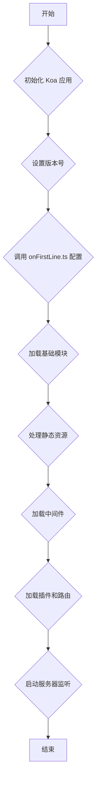

# 接口管理平台

本项目是一个接口管理平台，主体框架基于 [yapi](https://github.com/YMFE/yapi)，融合了 DocFlow 文档流功能，为团队提供完整的接口管理和文档协作解决方案。

!\[qq\_group]\(./docs/qq\_group.png null)

## 功能介绍

### 核心功能

#### 1. 接口管理

**基础 CRUD**

- 接口增删改查（`Interface.ts`），支持 `application/json`、`multipart/form-data`、`x-www-form-urlencoded`、`application/xml` 等请求体类型
- 完整的状态机管理：undone（设计中）→ done（开发中）→ open（测试中）→ closed（已发布）→ deleted（已删除）
- 软删除机制，支持回收站恢复
- 接口路径支持路径参数（`:id`）、Query 参数，自动生成接口完整 URL

**接口分类与组织**

- 接口集合（InterfaceCol）：类似 Postman Collection，支持文件夹层级嵌套
- 菜单树管理（`InterfaceCol.ts`），支持拖拽排序、批量移动接口到集合
- 多级目录结构，接口可归属于不同分类

**参数管理**

- 请求参数：Query 参数、Body 参数（form/json/text/xml/raw）、Headers、Path 参数
- 响应参数：支持 json、text、xml、raw、json-schema、backup、file 等响应类型
- 参数字段：name（参数名）、value（示例值）、example（说明）、required（必填标记）、desc（描述）
- 参数字段名唯一性校验，自动去除参数值中的 `\r\n`

**接口标签与状态**

- 标签系统（tag array），支持按标签筛选接口
- 状态流转：可设置接口当前所处阶段（设计/开发/测试/发布）
- 接口描述（markdown），支持富文本说明

**编辑冲突处理**

- 编辑锁机制，防止多人同时编辑同一接口产生冲突
- 冲突时显示"正在被其他人编辑"的提示
- 自动检测编辑状态，超时自动释放锁

**Swagger 同步**

- `Swagger.ts` 控制器，支持导入 Swagger 1.0/2.0 JSON 格式
- Swagger 自动同步插件（`yapi-plugin-swagger-auto-sync/`），支持定时从 URL 同步接口
- 同步时支持接口去重（按 path + method 匹配）、版本号管理

***

#### 2. Mock 服务

**动态 Mock**

- 基于 json-schema-faker，根据接口定义的 req\_body\_schema 和 res\_body\_schema 自动生成 Mock 数据
- 支持嵌套对象、数组、枚举、默认值等 Schema 特性
- 自动处理 required 字段、格式校验（email、url、date 等）

**高级 Mock**

- 自定义 Mock 脚本（`advanced-mock/server.js`），使用 JavaScript 编写 Mock 逻辑
- 支持在脚本中读取请求参数、请求头、Cookie、Session
- 可自定义响应状态码、响应头、响应体
- 支持 Mock 函数库：random（随机数据）、faker（假数据）、lodash（工具函数）

**条件 Mock**

- 根据请求参数值匹配不同的 Mock 规则
- 支持请求 IP 过滤，可限制特定 IP 访问 Mock 接口
- 支持 Cookie/Header 条件匹配
- 优先级排序，精确匹配优先于通配符匹配

**延迟与响应控制**

- 支持为 Mock 响应设置固定延迟时间（毫秒）
- 支持随机延迟范围
- Mock 用例管理：一个接口可创建多个 Mock 用例，每个用例对应不同的响应场景

**Mock 安全**

- 支持设置 Mock 接口的访问密码
- 支持 IP 白名单/黑名单控制
- 请求日志记录，支持查看 Mock 请求历史

***

#### 3. 项目管理

**环境与全局变量**

- 多环境配置（dev/test/pre/prod），每个环境独立设置 baseUrl 和 headers
- 环境变量（variable），支持在接口路径和参数中引用 `{{variable_name}}`
- 全局 Header：每个环境可设置独立的默认请求头

**脚本系统**

- Pre-request 脚本（`project.ts`）：接口请求前执行的 JavaScript 代码，可修改请求参数
- After-response 脚本：接口响应后执行的代码，可进行响应数据处理
- 脚本中可访问 `axios` 和自定义工具函数库

**权限与成员管理**

- 成员角色：owner（所有者）、maintainer（维护者）、developer（开发者）、guest（访客）
- 项目权限级别：private（私有）、public（公共）
- 成员分组管理，支持批量添加/移除成员
- Token 管理：项目级 API Token 生成与撤销

**项目配置**

- 自定义项目图标（emoji 或图片）
- 项目描述与标签
- 代码库 URL 关联（git URL）
- Webhook 配置，支持代码提交触发接口同步

***

#### 4. 用户与权限系统

**用户认证**

- JWT Token 认证（`User.ts`），accessToken 有效期可配置
- 邮箱 + 验证码注册（`yapi-plugin-advanced-mock/` 中的发送验证码接口）
- 密码加密存储（bcrypt）
- 用户头像自动生成（基于用户 ID 的 SVG 头像）

**角色层级**

- 超管（superman）：全系统管理员，可管理所有分组、项目、用户
- 组长（group owner）：管理分组下的所有项目和成员
- 项目所有者（project owner）：管理单个项目的配置和成员
- 普通用户（member）：使用接口、创建个人项目

**权限控制点**

- 接口操作权限：查看、编辑、删除、运行测试
- 项目操作权限：添加成员、修改配置、删除项目
- 分组操作权限：添加项目、管理子分组
- 系统操作权限：插件管理、系统配置

**个人空间**

- 个人分组（private 类型分组），用于存放个人项目
- 关注/粉丝机制（follow 表），可关注用户和项目
- 关注者动态（follow\_news），推送关注项目的更新

***

#### 5. 分组管理

**分组基础管理**

- 分组 CRUD（`Group.ts`），支持分组名称、描述、类型（private/group/project）
- 分组树结构，支持多级嵌套
- 分组排序（order 字段）

**分组与成员**

- 成员管理：添加/移除分组管理员和普通成员
- 分组级权限继承，子项目继承分组权限
- 分组图标和自定义配置

**个人分组**

- 每个用户自动拥有个人分组（type=private）
- 个人分组下的项目默认只有创建者可访问
- 可将项目从个人分组移动到团队分组

***

#### 6. 测试集与自动化测试

**测试集管理**

- 接口集（InterfaceCol）：将多个接口组织到一个集合中
- 测试用例（`InterfaceCol.ts`）：每个测试用例对应一个接口请求
- 测试用例配置：请求方法、URL、参数、headers、断言条件
- 支持用例间参数传递（setParameters/getParameters）

**自动化测试执行**

- 测试集执行引擎（`Open.ts` 中的 runAutoTest），基于 axios 发送请求
- 支持批量执行测试用例，按顺序或并行
- 执行时收集每个步骤的请求数据、响应数据、执行时间、断言结果

**报告生成**

- HTML 报告：可视化的测试报告，包含用例通过率、响应时间趋势
- JSON 报告：结构化数据，便于集成 CI/CD 系统
- 支持测试结果邮件通知（`Test.js` 邮件发送逻辑）

**测试断言**

- 支持响应状态码断言
- 支持响应体 JSON 路径断言（`bodyMatch` 字段）
- 支持响应时间阈值断言
- 断言失败时终止后续用例或继续执行（可配置）

***

#### 7. 数据导入导出

**导入功能**

| 插件                           | 文件              | 支持格式                     |
| ---------------------------- | --------------- | ------------------------ |
| yapi-plugin-import-postman   | `importData.js` | Postman Collection v1/v2 |
| yapi-plugin-import-swagger   | `importData.js` | Swagger 1.0/2.0 JSON     |
| yapi-plugin-import-har       | `importData.js` | HAR (HTTP Archive)       |
| yapi-plugin-import-yapi-json | `importData.js` | YApi JSON 导出格式           |

- 导入时选择目标分组/项目
- 接口去重策略：同名接口可选择覆盖或新建
- 自动创建缺失的分类目录

**导出功能**

| 插件                               | 文件              | 输出格式                  |
| -------------------------------- | --------------- | --------------------- |
| yapi-plugin-export-data          | `exportData.js` | Markdown              |
| yapi-plugin-export-data          | `exportData.js` | JSON                  |
| yapi-plugin-export-data          | `exportData.js` | HTML                  |
| yapi-plugin-export-swagger2-data | `exportData.js` | Swagger 2.0 YAML/JSON |
| yapi-plugin-gen-services         | `exportData.js` | TypeScript/JS 服务代码    |

- 导出范围可选：全部接口、单个项目、指定接口集
- Markdown 导出包含接口描述、请求参数、响应示例
- Swagger 导出支持生成完整的 OpenAPI 2.0 文档

***

#### 8. CI/CD 持续集成

**Git 仓库关联**

- 关联项目 Git 仓库 URL（`CiCd.ts`）
- 自动从 Git 提交记录中提取接口变更信息
- 仓库类型支持 GitHub/GitLab/Gitee

**Webhook 管理**

- Webhook 创建与管理（`CiCd.ts`）
- 支持配置 Webhook 触发条件（push/pull request/tag）
- Webhook 任务队列管理，记录触发历史
- Webhook 执行状态：pending/running/success/failed

**任务队列**

- 自动化测试任务（runAutoTest）：定时或手动触发测试集执行
- 文档同步任务：定时从 Swagger URL 同步接口
- 任务重试机制，失败后自动重试
- 任务历史记录和日志查看

***

#### 9. Wiki 文档系统

**文档管理**

- 文档 CRUD（`WikiCustom.ts`），支持富文本内容
- 多级文档目录，支持文档嵌套
- 文档排序（order 字段），拖拽调整顺序
- 文档标签管理

**文档权限**

- 四级权限体系（`WikiCustom.ts`）：private（私有）、group（分组可见）、project（项目可见）、all（公开）
- 项目 Wiki 与独立 Wiki 两种模式
- Wiki 插件（`yapi-plugin-wiki/`）扩展功能

**文档功能**

- Markdown 文档编写
- 文档版本历史（`WikiHistory.ts`），支持版本对比（Diff）
- 文档搜索（`Search.ts`），支持按标题和内容搜索
- 文档评论和反馈

***

#### 10. 资源管理

**文件上传**

- 分片上传（`Resource.ts`）：大文件分块传输，支持断点续传
- 进度跟踪：记录上传进度百分比
- 文件元数据存储：原始文件名、文件大小、MIME 类型、存储路径
- 文件格式支持：图片、音视频、文档、压缩包等

**云盘功能**

- 个人云盘：存储用户上传的文件
- 项目云盘：存储项目相关文件
- 文件夹管理：创建、删除、重命名文件夹
- 存储配额管理（`RESOURCE_ASSETS_REMOTE` 配置）

**媒体流处理**

- 音视频文件流式传输
- 支持 HTTP Range 请求（断点续传播放）
- 图片压缩处理（基于 Sharp）
- 音频格式转换（基于 ffmpeg/mp3info）

***

#### 11. 通知与动态

**操作日志**

- 完整的操作日志记录（`Log.ts`）
- 日志类型：增删改查、登录登出、权限变更
- 日志查询：按时间、用户、操作类型筛选

**邮件通知**

- nodemailer 邮件发送
- 支持配置 SMTP 服务器（QQ/163/Gmail）
- 邮件场景：用户注册验证码、测试报告发送、项目通知
- 邮件模板支持 HTML 格式

**实时通知**

- SSE（Server-Sent Events）实时推送（`SSE.ts`）
- WebSocket 实时通信（Hocuspocus）
- 通知类型：新接口通知、项目变更通知、@提及通知

***

#### 12. 搜索功能

**全文搜索**

- `Search.ts` 控制器，支持搜索项目、分组、接口、用户
- 搜索范围可限定：全局搜索、项目内搜索、分组内搜索
- 支持关键字高亮显示

**搜索结果**

- 按类型分组显示结果
- 接口搜索支持按 method（GET/POST/PUT/DELETE）筛选
- 用户搜索支持按用户名、邮箱搜索
- 分页显示，默认每页 20 条

***

#### 13. 系统管理

**SSE 实时通信**

- `SSE.ts`（`server/controllers/Autoware/api/SSE.ts`）
- 支持用户状态实时推送
- 事件类型：login（登录）、logout（登出）、open（打开接口）、close（关闭接口）

**系统配置**

- MongoDB 数据库连接配置
- 插件启用/禁用管理
- 系统公告管理

***

#### 14. 插件系统

**官方插件**

| 插件名称                             | 功能                       |
| -------------------------------- | ------------------------ |
| yapi-plugin-advanced-mock        | 高级 Mock：自定义脚本、条件匹配、IP 过滤 |
| yapi-plugin-import-postman       | 导入 Postman Collection    |
| yapi-plugin-import-swagger       | 导入 Swagger 文档            |
| yapi-plugin-import-har           | 导入 HAR 格式                |
| yapi-plugin-import-yapi-json     | 导入 YApi JSON             |
| yapi-plugin-export-data          | 导出 Markdown/JSON/HTML    |
| yapi-plugin-export-swagger2-data | 导出 Swagger 2.0           |
| yapi-plugin-gen-services         | 生成服务代码（TypeScript/JS）    |
| yapi-plugin-swagger-auto-sync    | Swagger 自动同步             |
| yapi-plugin-statistics           | 接口使用统计                   |
| yapi-plugin-test                 | 测试集与自动化测试                |
| yapi-plugin-wiki                 | Wiki 文档系统                |

**插件机制**

- `plugin.json` 声明插件列表和配置
- 插件加载顺序管理（`plugin.js` 入口）
- 插件自定义路由、中间件、数据模型
- 插件可扩展 Controller、Model、Middleware

***

### 技术特点

- **前端**：Vue 2.x + 原生 JavaScript（兼容 TS 语法），动态模块加载机制
- **后端**：Node.js + Koa + MongoDB/Mongoose，TypeScript 编写，模块化架构设计
- **编辑器**：集成 Toast UI Editor 和 DocFlow 块级编辑器（基于 Tiptap/ProseMirror）
- **协作**：基于 Yjs CRDT 算法实现实时协作，配合 Hocuspocus WebSocket 服务
- **AI 辅助**：集成 AI 头脑风暴、文本润色、文档续写等功能
- **Mock**：json-schema-faker + MockJS + 自定义脚本
- **部署**：支持 Docker 容器化部署，便于环境管理

## 架构概览


```mermaid
flowchart TD
    A[开始] --> B{初始化 Koa 应用}
    B --> C{设置版本号}
    C --> D{调用 onFirstLine.ts 配置}
    D --> E{加载基础模块}
    E --> F{处理静态资源}
    F --> G{加载中间件}
    G --> H{加载插件和路由}
    H --> I{启动服务器监听}
    I --> J[结束]
```

## 目录结构

```
yapi/
├── DocFlow/          # DocFlow 文档流功能（独立子项目）
│   ├── apps/         # 应用程序
│   └── packages/     # 共享包
├── common/           # 公共工具和配置
├── docs/             # 项目文档和资源
├── exts/             # 插件扩展
│   ├── yapi-plugin-advanced-mock/      # 高级 Mock 插件
│   ├── yapi-plugin-export-data/       # 数据导出插件
│   ├── yapi-plugin-export-swagger2-data/  # Swagger 导出
│   ├── yapi-plugin-gen-services/      # 服务生成插件
│   ├── yapi-plugin-import-har/        # HAR 导入
│   ├── yapi-plugin-import-postman/    # Postman 导入
│   ├── yapi-plugin-import-swagger/     # Swagger 导入
│   ├── yapi-plugin-import-yapi-json/   # YApi JSON 导入
│   ├── yapi-plugin-statistics/        # 统计插件
│   ├── yapi-plugin-swagger-auto-sync/ # Swagger 自动同步
│   ├── yapi-plugin-test/               # 测试插件
│   └── yapi-plugin-wiki/              # Wiki 文档插件
├── server/           # 后端服务
│   ├── controllers/  # 控制器（Autoware 路由系统）
│   ├── middleware/   # 中间件
│   ├── models/       # 数据模型
│   ├── plugins/      # 插件系统
│   ├── utils/        # 工具函数
│   └── uploads/      # 文件上传目录
├── static/           # 静态资源
│   ├── business_yapi/  # 前端 Vue 应用
│   └── common/         # 公共组件和资源
└── test/             # 测试文件
```

## 使用流程

### 1. 接口管理流程

1. **创建项目**：登录系统后，点击「新建项目」，填写项目名称、描述、成员等信息
2. **添加接口**：在项目中点击「新建接口」，填写接口路径、方法、参数等信息
3. **配置 Mock**：在接口详情页，配置 Mock 规则和响应数据
4. **测试接口**：使用内置测试工具测试接口，验证响应数据
5. **生成文档**：系统自动生成接口文档，可导出 Markdown/Swagger 格式
6. **Swagger 同步**：如已有 Swagger 文档，可直接导入或配置自动同步

### 2. DocFlow 文档使用流程

1. **创建文档**：在项目中点击「新建文档」，选择文档类型
2. **编辑内容**：使用块级编辑器编辑文档，添加文本、标题、列表等内容
3. **邀请协作**：点击「分享」按钮，邀请团队成员协作编辑
4. **使用 AI 辅助**：点击 AI 按钮，使用头脑风暴、文本润色等功能
5. **版本管理**：系统自动保存版本历史，可查看和恢复历史版本

### 3. 代理服务使用流程

1. **配置代理**：在项目设置中，配置代理目标地址
2. **生成代理 URL**：系统生成代理 URL，前端开发可使用此 URL 访问后端服务
3. **监控请求**：在代理日志中查看请求详情，排查问题

### 4. 内网穿透使用流程

1. **配置 frp**：在服务器上配置 frp 服务端
2. **启动客户端**：在本地启动 frp 客户端，连接到服务端
3. **访问本地服务**：外网同事通过分配的域名访问本地开发服务

## 启动

### 环境要求

- **Node.js** >= 16
- **pnpm** >= 8
- **MongoDB** >= 4.0
- **frp**（可选，用于内网穿透）

### 配置文件

创建 `xspace_configs.js` 文件（项目根目录外）：

```js
/* xspace_configs.js */
module.exports = {
	CLOUD_DISK_ROOT: "********",
	cors: {
		allow: ["****************"]
	},
	port: "****",
	adminAccount: "********",
	db: {
		servername: "********",
		DATABASE: "********",
		port: "********"
	},
	mail: {
		enable: true,
		host: "smtp.qq.com",
		port: 465,
		from: "********",
		auth: {
			user: "********",
			pass: "********"
		}
	},
	baiduTranslate: {
		appId: "********",
		appKey: "********"
	},
	proxyOptions: {
		targets: {
			/* ********** */
		}
	}
};
```

### 启动步骤

1. **安装依赖**
   ```bash
   pnpm install
   ```
2. **启动服务**
   ```bash
   pnpm start
   ```
3. **访问应用**
   打开浏览器访问：`http://localhost:3000`

## 项目评价

### 优点

1. **功能全面**：集成了接口管理、Mock 服务、数据导入导出、代理服务和 DocFlow 文档流等多种功能，满足团队协作的全方位需求
2. **插件生态**：内置 12+ 官方插件，覆盖导入导出、Mock 增强、统计、Wiki 等场景
3. **技术先进**：融合了 Yjs 实时协作、AI 辅助编辑、CRDT 算法等前沿技术
4. **高度定制**：支持自定义 Mock 脚本、代理配置、插件开发，适应不同团队的业务需求
5. **安全可靠**：内置权限管理、版本控制、WebSocket 安全等功能
6. **模块化架构**：清晰的目录结构，Autoware 路由系统，后端 TypeScript 编写

## Roadmap 规划

### 短期计划（1-3个月）

#### 核心功能完善

- [ ] 优化 DocFlow 编辑器性能，支持更大文档的编辑
- [ ] 完善 AI 功能，增加文档智能总结和自动分类
- [ ] 改进接口测试功能，支持更多测试场景
- [ ] 优化 Autoware 路由系统，增强类型安全

#### 技术架构改进

- [ ] 重构后端代码，优化数据库查询性能
- [ ] 实现前端代码的模块化和组件化
- [ ] 完善错误处理和日志系统
- [ ] 优化静态资源加载策略

### 中期计划（3-6个月）

#### 新功能开发

- [ ] 集成团队协作工具，支持任务分配和进度跟踪
- [ ] 实现接口版本管理和变更历史对比
- [ ] 增加 API 监控和告警功能
- [ ] 开发移动端适配，支持移动设备访问

#### 技术升级

- [ ] 考虑迁移前端到 Vue 3 或其他现代框架
- [ ] 增强 TypeScript 编译支持
- [ ] 实现 CI/CD 自动化部署流程
- [ ] 优化容器化部署方案

### 长期计划（6-12个月）

#### 生态系统建设

- [ ] 开发插件市场，支持第三方插件扩展
- [ ] 构建 API 开放平台，支持外部系统集成
- [ ] 建立用户社区，促进知识共享
- [ ] 开发企业级解决方案，支持大型团队协作

#### 技术创新

- [ ] 探索 AI 驱动的接口设计和测试
- [ ] 实现低代码接口开发能力
- [ ] 开发智能 API 文档生成系统
- [ ] 探索 DocFlow 与 YApi 的深度集成

## 开发记录

- **xU.js configs xU.validateParams**：只接受限定的参数，多余的会被过滤掉 => model 里面 schemaMap
- **跨域+Nginx+frp**：解决携带 cookies 的问题
- **Ajv 接口校验**：使用 Ajv 进行接口参数校验
- **资源管理**：RESOURCE\_ASSETS\_REMOTE 重命名为 CLOUD\_DISK\_ROOT，为单个地址
- **Autoware 路由系统**：新的模块化路由系统，替代原有 YApi 路由
- **WebSocket 实时通信**：基于 Hocuspocus 的实时协作支持
- **图片处理优化**：集成 Sharp/Jimp 进行图片压缩和处理
- **音频处理**：支持音频文件处理和转换
- **CI/CD 集成**：支持自动化部署流程

<br />

