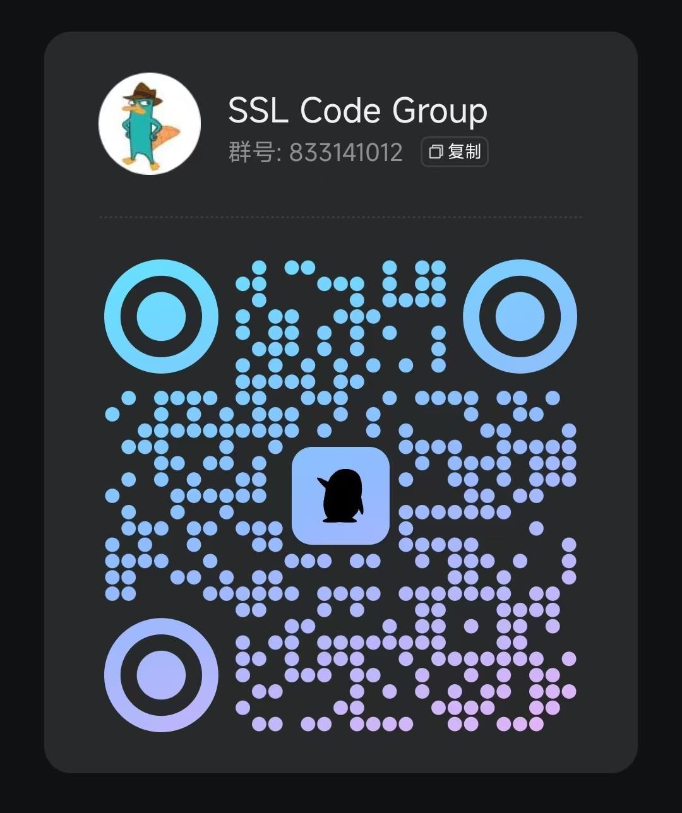

# 接口管理平台

本项目是一个接口管理平台，主体框架基于 [yapi](https://github.com/YMFE/yapi)



## 特性

提供公司局域网内部，代理后端服务
- 前端开发人员只需要代理到对应项目的mock地址
- 后端开发人员可以针对接口提供mock数据、开发机环境、测试环境等
    - 

    - 
- 启用内网穿透，外网的同事也能如同本地开发一样访问本地服务


## 启动


- mongodb **必要**
- 入口文件 server/app.js
    - server\utils\onFirstLine.ts

```js
/* server\utils\onFirstLine.ts */
/*  引入在项目目录以外的yapi_configs.js*/
const yapi_configs = require("../../../yapi_configs.js");
```

```js
/* 基本的配置信息 */
/* yapi_configs.js */
module.exports = {
	RESOURCE_ASSETS_REMOTE: "********",
	cors: {
		allow: ["****************"]
	},
	port: "****",
	adminAccount: "********",
	db: {
		servername: "********",
		DATABASE: "********",
		port: "********"
	},
	mail: {
		enable: true,
		host: "smtp.qq.com",
		port: 465,
		from: "********",
		auth: {
			user: "********",
			pass: "********"
		}
	},
	baiduTranslate: {
		appId: "********",
		appKey: "********"
	},
	proxyOptions: {
		targets: {/* ********** */}
	}
};
```
    - pnpm install
    - pnpm start

## 开发记录

- xU.js configs
xU.validateParams

只接受限定的参数，多余的会被过滤掉 => model 里面 schemaMap

- 跨域+Nginx+frp 导致携带 cookies 很麻烦

mongodb

```js
db.col.update(
	{ title: "MongoDB 教程" },
	{ $set: { title: "MongoDB" } },
	{ multi: true }
);
```

Ajv 接口校验 scheme 的参数

[如何使用 JavaScript 嵌套函数从 jsDoc 创建类型定义(.d.ts)文件。](https://www.volcengine.com/theme/4203294-R-7-1)
